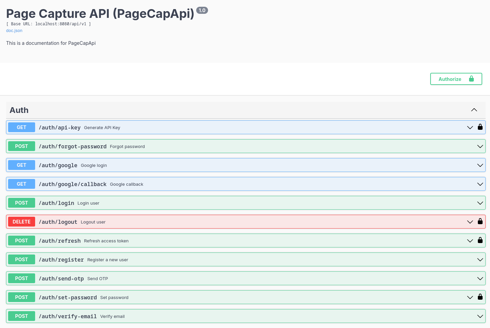
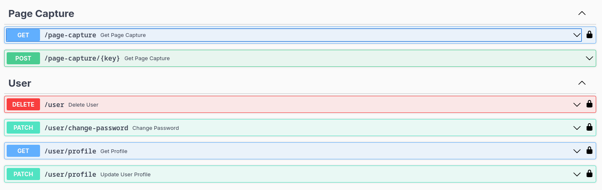

# PageCapAPI

PageCapAPI is a web page screenshot API built with Go. The project adopts Domain-Driven Design (DDD) principles and
applies Hexagonal Architecture to maintain a clean separation between the core business logic and infrastructure
concerns.

## Why DDD and Hexagonal Architecture?

This architecture was chosen to make the system easy to extend, such as adding new interfaces like gRPC or GraphQL,
without affecting the core business logic.

From my experience working with large codebases using traditional MVC or service pattern architectures, maintainability
becomes a challenge as the codebase grows. Navigating and managing logic becomes harder, and scrolling through massive
files or deeply nested directories is often frustrating during development.

By contrast, using DDD and Hexagonal Architecture helps clearly separate concerns and responsibilities, making the code
easier to understand, test, and evolve. It improves developer experience by keeping each part of the system focused on
its own responsibility, leading to better scalability and maintainability over time.

## Architecture Overview

The project structure reflects a hexagonal architecture approach, organized into the following main directories within
the `internal/` folder:

- **`domain/`**: Contains the core business logic, entities, and interfaces (contracts) that define the application's
  domain. This layer is independent of any infrastructure details and is the heart of the application, reflecting the
  business concepts. This aligns with the core focus of DDD.
- **`application/`**: Houses the application's use cases or interactors. These orchestrate the domain entities and
  interact with infrastructure through interfaces defined in the domain layer. This layer defines the application's
  capabilities.
- **`infrastructure/`**: Provides the concrete implementations for the interfaces defined in the domain layer. This
  includes database access (PostgreSQL), external services (Redis, JWT, Mail, Cloudinary), and persistence logic. These
  are the "adapters" that connect the core logic to the outside world, implementing the "ports" defined in the domain
  layer.
- **`interfaces/`**: Contains the entry points into the application, such as HTTP handlers and routes. This layer
  translates external requests into calls to the application layer and formats responses. These also act as adapters to
  the core.
- **`shared/`**: Includes common utilities, base entities, and generic repository interfaces used across different
  layers.

This structure, combining DDD principles with Hexagonal Architecture, ensures that the core business logic (`domain` and
`application`) remains independent of external frameworks and databases. This makes it easier to change or replace
infrastructure components without affecting the core functionality, improving the system's resilience and
maintainability.

## Purpose

The purpose of PageCapAPI is to provide an efficient and flexible screenshot service for web pages. It allows clients to
programmatically capture website previews and supports various customization options to suit different use cases.

## Features

- **Web Page Screenshotting**: Capture screenshots of web pages using the dedicated API endpoint.
- **Authentication**: Secure API access using JWT (access and refresh tokens) for certain operations and API keys for
  page capture. Supports standard login with email verification (via OTP) and OAuth/Google login.
- **Email Verification (OTP)**: Users are required to verify their email address via a One-Time Password (OTP) before
  they can fully log in.
- **User Management**: Functionality for managing users (details not fully explored, but handlers and use cases exist).
- **Swagger Documentation**: API documentation available via Swagger.
- **Database Integration**: Uses PostgreSQL for data persistence.
- **Caching**: Utilizes Redis for caching mechanisms.
- **External Service Integration**: Integrates with Cloudinary for image storage and a mail service for sending
  verification emails.

## How to Run

To run this project, you will need:

- Go (version 1.18 or higher recommended)
- PostgreSQL database
- Redis instance
- Cloudinary account
- Configured email service for sending OTPs
- `air` for live reloading (install with `go install github.com/cosmtrek/air@latest`)
- Environment variables configured (refer to `.env.example`)

You are free to use local installations of PostgreSQL and Redis or manage them via Docker or other means. Ensure they
are accessible based on your `.env` configuration.

Follow these steps:

1. **Clone the repository:**
   ```bash
   git clone https://github.com/SyahrulBhudiF/PageCapApi.git
   cd PageCapApi
   ```
2. **Set up environment variables:**
   Copy the example environment file and update it with your configuration:
   ```bash
   cp .env.example .env
   # Edit the .env file with your database credentials, Redis connection, Cloudinary details, email service configuration, etc.
   ```
3. **Run database migrations:**
   The project uses a Makefile for common tasks. Run the migrate command:
   ```bash
   make migrate
   ```
4. **Generate Swagger documentation:**
   ```bash
   make swagger
   ```
5. **Run the application using `air`:**
   ```bash
   air
   ```
   Alternatively, you can use `make setup` to run swagger and migrate, and then `air`.

The API should now be running on `http://localhost:8080` with live reloading enabled.

## How to Use

The base path for all API endpoints is `/api/v1/`.

The API provides various endpoints for authentication, user management, and page capturing. Refer to the Swagger
documentation at `http://localhost:8080/swagger/index.html` for detailed information on available endpoints,
request/response formats, and parameters.



### Authentication

- **Standard Login with Email Verification**: To log in with a username and password, you must first register and verify
  your email address. The verification process involves sending an OTP to your registered email. Once verified, you can
  log in and obtain JWT tokens.
- **JWT Authentication**: The API uses both access and refresh tokens. Access tokens are short-lived and used for
  authenticating most API requests. Refresh tokens are longer-lived and used to obtain new access tokens when the
  current one expires. Access tokens are usually sent in the `Authorization` header as `Bearer <your_access_token>`.
- **OAuth/Google Login**: The API supports logging in using your Google account via OAuth. Refer to the Swagger
  documentation for the specific endpoints and flow for initiating and completing the Google OAuth process.
- **API Key Authentication**: Used specifically for the page capture endpoint. You need to generate an API key using an
  authenticated endpoint (which requires a valid access token). The generated API key is valid for approximately 1 hour.
  This API key is then used to authenticate requests to the page capture endpoint.

To capture a page, you will first need to obtain JWT tokens (either via standard login with email verification or Google
OAuth), then use a valid access token to call the endpoint that generates an API key, and finally use the generated API
key to call the page capture endpoint.
